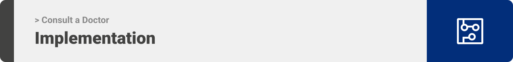

<div align="center">

> Consult a doctor is a platform where the distance between patients and doctors is very close and the communication in seamless.

**[PROJECT PHILOSOPHY](https://github.com/abedulaziz/Consult-a-doctor#-project-philosophy) • [WIREFRAMES](https://github.com/abedulaziz/Consult-a-doctor#-wireframes) • [TECH STACK](https://github.com/abedulaziz/Consult-a-doctor#-tech-stack) • [IMPLEMENTATION](https://github.com/abedulaziz/Consult-a-doctor#-impplementation) • [HOW TO RUN?](https://github.com/abedulaziz/Consult-a-doctor#-how-to-run)**

</div>

<br><br>


> Consult a doctor is a medical web application targets patients and doctors to benefit each of them. You can consider the application as your always-ready doctor.
>
> There are several specializations available in the app. Patients or doctors are able to create video chat rooms with doctors and discuss their medical issue.

### User Stories
- As a patient, I want to search doctors and access thier profiles.
- As a patient, I want to schedule a meeting with any doctor.
- As a patient, I want to inquire my medical issue with specialized doctor.

<br>

- As a doctor, I want to benefit materially from the meetings.
- As a doctor, I want to add blogs on my profile concerning my medical speciality
- As a doctor, I want to update my profile information.
- As a doctor, I want to set a profile picture and profile background image.

<br>

- As an admin, I want to add new specializations to the app.
- As an admin, I want to delete specializations from the app.
- As an admin, I want to accept and deny doctor account requests.

<br><br>


> This design was planned before on paper, then moved to Figma app for the fine details. Here are some figma samples.
Note that the app styling is a fresh CSS modules without using any library or preprocessor.

| Landing  | Profile  |
| -----------------| -----|
|  |  |

| Specializations  | Doctor sign-up  |
| -----------------| -----|
|  |  |

<!-- | Artists results  | Artist's Albums  |
| -----------------| -----|
|  |  | -->


<br><br>


Here's a brief high-level overview of the tech stack the Consult a Doctor uses:

- This project uses the [React frontend framework for the frontend](https://reactjs.org/). React is a free and open-source front-end JavaScript library for building user interfaces based on UI components.

- For the storage (database), the app uses the [MySQL](https://www.mysql.com/) relational database management system.

- The app uses [Laravel](https://laravel.com/) web application framework for dealing with the backend and filtering/authorizing HTTP requests.


<br><br>



> Using the mentioned tech stack and the wireframes build with figma from the user stories we have, the implementation of the app is shown as below, these are screenshot samples from the real app.

| Landing  | Profile  |
| -----------------| -----|
|  |  |

| sign-in | Doctor sign-up  |
| -----------------| -----|
|  |  |

| Appointments  |  Specializations |
| -----------------| -----|
|  |  |


<br><br>


> This is an example of how you may give instructions on setting up your project locally.
To get a local copy up and running follow these simple example steps.

### Prerequisites

This is an example of how to list things you need to use the software and how to install them.
* npm
  ```sh
  npm install
  ```

### Installation

_Below is an example of how you can instruct your audience on installing and setting up your app. This template doesn't rely on any external dependencies or services._

1. Clone the repo
   ```sh
   git clone https://github.com/abedulaziz/Consult-a-doctor.git
   ```
2. Install NPM packages
   ```sh
   npm install
   ```
3. Navigate to the backend folder
   ```sh
   cd consult-a-doctor_backend
   ```
4. Run laravel server
   ```sh
   php artisan serve
   ```
5. Navigate to the frontend folder
   ```sh
   cd ..
   cd consult-a-doctor_frontend
   ```
6. Run Node.js server for the frontend
   ```sh
   cd npm start
   ```
6. Navigate to the WebRTC folder
   ```sh
   cd ..
   cd WebRTC_backend
   ```
6. Run Node.js server for WebRTC feature
   ```sh
   cd npm run serve
   ```


